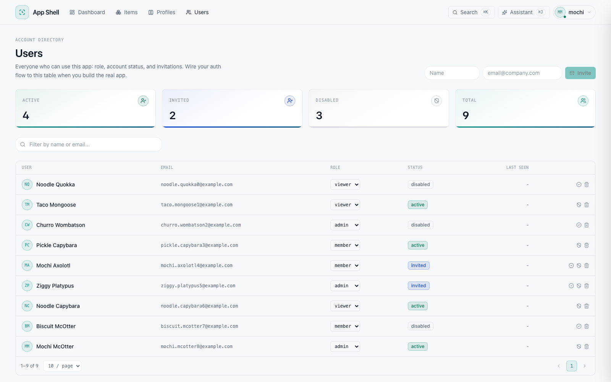

# app-shell

A clonable app shell: working plumbing and a settled design system,
minus any domain. Clone it, describe your app in one file, and have a
coding agent build the real thing on rails that already work.

The stack: FastAPI, Postgres 16, and SQLAlchemy Core with raw-SQL
migrations (no ORM, no Alembic). React 19 with Vite and Tailwind v4,
CSS-first, every token in one file. The Anthropic SDK sits behind a
single instrumented wrapper, and a ⌘J AI assistant with tools and a
human approval gate is built in. One Docker container, one port. There
is intentionally no monitoring stack. The reasoning behind all of this
lives in [BLUEPRINT.md](BLUEPRINT.md).



More screenshots and the full architecture diagrams (Mermaid, rendered
right on GitHub) live in [docs/ARCHITECTURE.md](docs/ARCHITECTURE.md).

## The workflow

```
git clone <this repo> my-app && cd my-app
$EDITOR APP_SPEC.md          # what it is, what it does, outcome, audience, context
claude                        # or any coding agent
> Read CLAUDE.md, BLUEPRINT.md and APP_SPEC.md, then build the app.
```

Or skip editing APP_SPEC.md and paste a single self-contained prompt -
[PROMPTS.md](PROMPTS.md) has two fully worked examples (a healthcare
patient portal and an e-commerce customer portal) plus the skeleton for
writing your own.

The agent inherits a settled design system and architecture (CLAUDE.md
tells it exactly what exists and what to replace), so it spends its effort
on your domain instead of re-deriving buttons and plumbing.

## Run it (Docker Desktop - zero toolchain)

```bash
just run          # builds the image, starts Postgres + app
```

Open http://localhost:8765 - the API serves the built UI from one port,
bound to localhost only. `just stop` tears it down; `just logs` tails.

Without `just`: `docker compose -f deploy/docker/compose.yaml --profile app up --build -d`.

## Develop it (hot reload)

Prereqs: [uv](https://docs.astral.sh/uv), Node 22+, Docker,
[just](https://github.com/casey/just).

```bash
just install      # uv sync + npm install
just env          # .env from .env.example - add your ANTHROPIC_API_KEY
just up           # Postgres only
just db-init      # apply migrations
just seed         # demo rows for the example page
just api          # FastAPI :8765 (hot reload)   - terminal 1
just ui           # Vite :5173 (proxies /api)    - terminal 2
```

Quality gates: `just check` (ruff + mypy + pytest). Integration tests
(`just test-integration`) spin up a throwaway Postgres via testcontainers.

## What's inside

```
APP_SPEC.md               ← describe your app here
PROMPTS.md                ← worked example prompts to hand a coding agent
CLAUDE.md                 ← agent build instructions
BLUEPRINT.md              ← the settled design system & architecture
src/appshell/
  api/                    FastAPI: lifespan -> routers -> SPA mount (last)
  storage/                db.py, migrator.py, repositories.py, migrations/*.sql
  schemas/                pydantic contracts (the on-disk format)
  observability/          structlog config + the one LLM wrapper (cost ledger)
  cli/                    click CLI - the canonical business-logic surface
  agents/                 assistant loop + tool catalog (approval-gated)
tests/                    unit (default) + integration (testcontainers)
ui/
  src/index.css           the ENTIRE design system: tokens, both themes, utilities
  src/components/         primitives + Layout/TopBar/⌘K palette
  src/pages/              Dashboard (hero), Items (list), Profiles (list->detail)
deploy/docker/            3-stage Dockerfile + compose (postgres / --profile app)
docs/ARCHITECTURE.md      Mermaid architecture diagrams + screenshots
justfile                  the dev-loop source of truth (incl. `just screenshots`)
```

The **Items** resource is a deliberate example thread - migration ->
repository -> route -> list page - demonstrating every convention end to
end. Your agent replaces it with your first real entity and keeps the
shape.

## The built-in assistant (⌘J)

Every app cloned from this template ships with an AI assistant drawer:
it chats over SSE, operates the app through a typed tool catalog
(read-only tools run freely; mutating tools pause for your approval),
and persists conversations in Postgres so a refresh reattaches
mid-stream. It needs `ANTHROPIC_API_KEY` in `.env`. Swap the example
item tools in `src/appshell/agents/assistant_tools.py` for your domain's
and the rest comes along for free.
