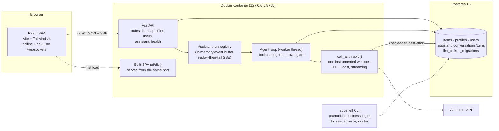
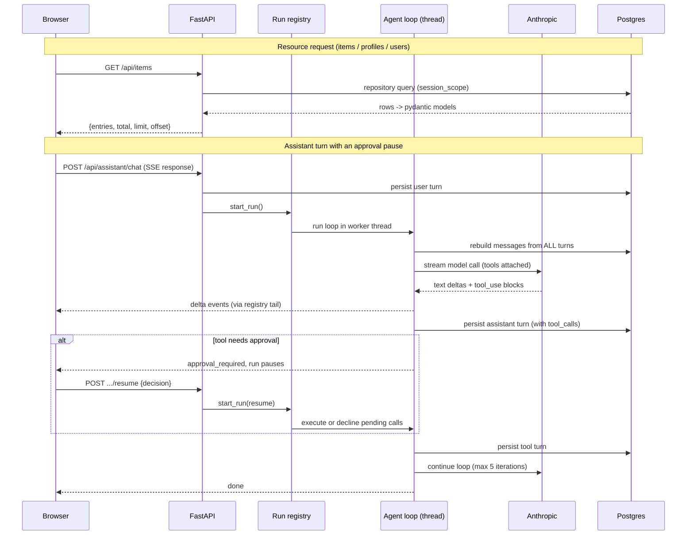
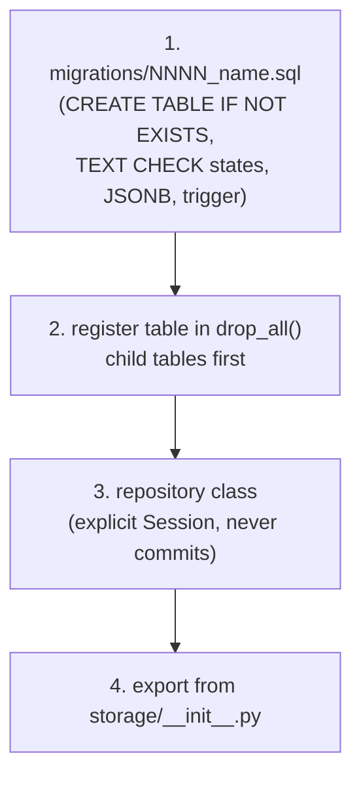
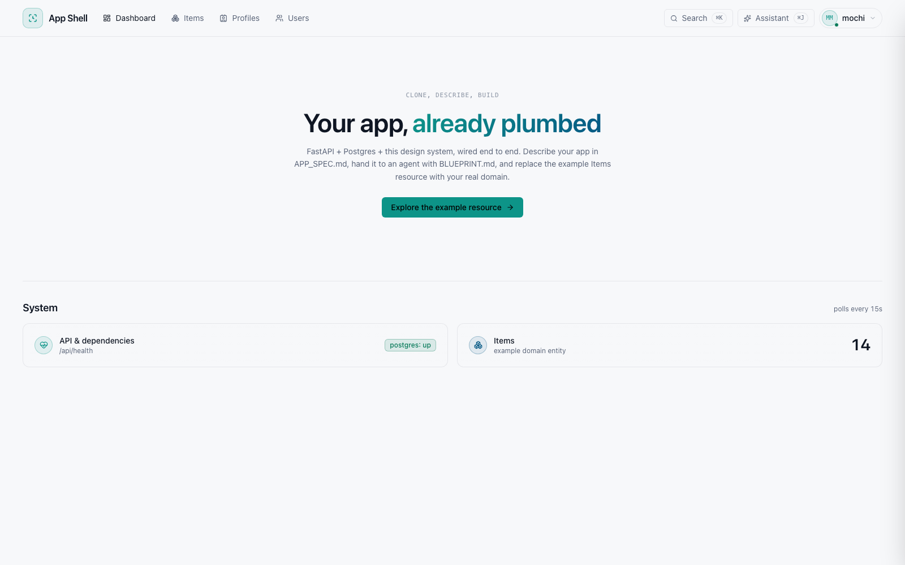
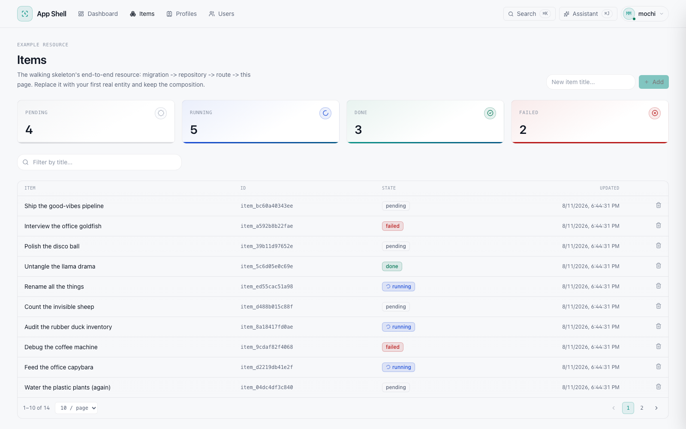
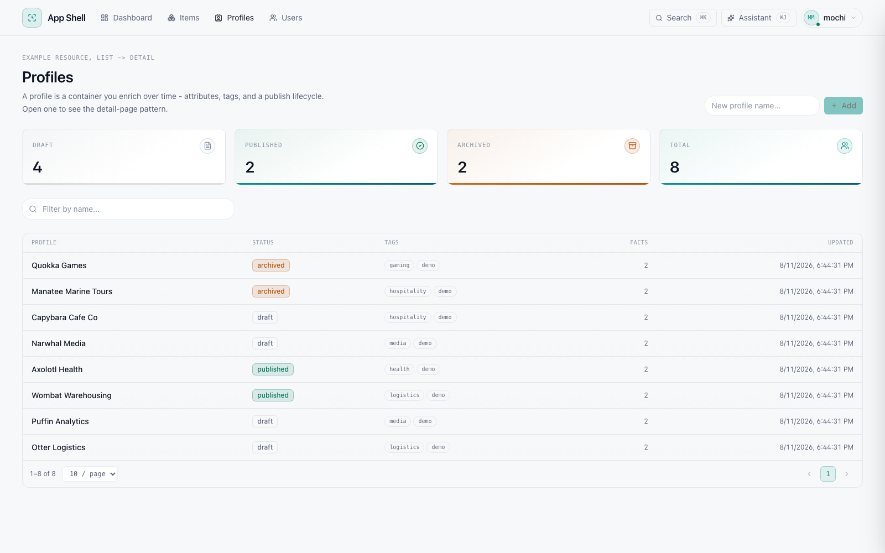
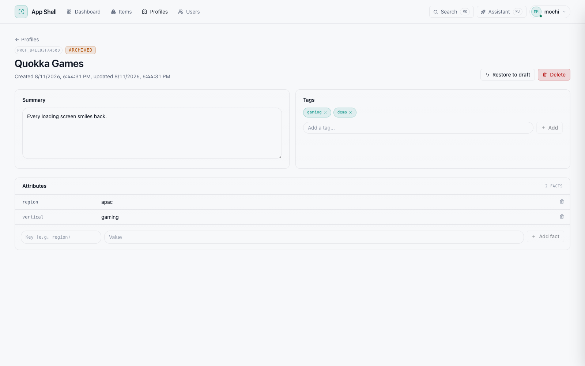

# Architecture

Diagrams for the shipped template. **If you build an app from this
template, regenerate this file for your domain** (CLAUDE.md build step 8):
keep the diagram structure, swap the example entities and tools for
yours. GitHub renders the Mermaid blocks directly, so this file is the
always-current architecture page for your repo.

## System overview

One container, one port. FastAPI serves both the API and the built SPA;
Postgres is the source of truth; the assistant reaches Anthropic through
a single instrumented wrapper.

## Request paths

Plain resources are synchronous and boring on purpose. The assistant is
the one asynchronous surface, and its durable state lives in Postgres,
never in the event buffer.

## Storage contract

Every persisted entity follows the same four steps. Skipping the
`drop_all()` registration is the classic silent breakage.

## Screenshots

Light theme, captured from the seeded demo. Regenerate with
`just screenshots` while the app is running.

| Dashboard | Items |
| --- | --- |
|  |  |

| Profiles | Profile detail | Users |
| --- | --- | --- |
|  |  |  |
